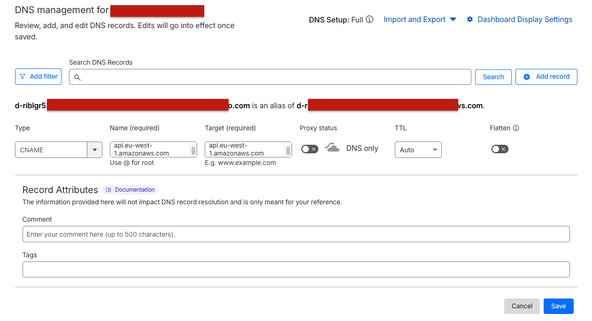

# 🌐 Custom Domain Setup Guide

This guide walks you through configuring a **custom domain** for your self-hosted Ingestro Pipelines deployment.

It covers:

- Creating an ACM certificate
- Validating the certificate via DNS
- Updating your Pulumi configuration
- Deploying the infrastructure
- Adding the final API Gateway CNAME
- Testing your setup
- Uninstall instructions

<aside>

> ⚠️ Important: Complete this guide **before** running `pulumi up` if you want to use a custom domain.

</aside>

---

## 1. Generate the SSL Certificate

Before you can use a custom domain, you must create an **AWS ACM certificate** in the same region as your API Gateway.

From inside the **pipelines-selfhost** repository, run:

```bash
./scripts/create-certificate.sh -d {your_domain} -r {aws_region}
```

Example:

```bash
./scripts/create-certificate.sh -d selfhost.acme.com -r eu-central-1
```

You will see output similar to:

```bash
🔐 Creating ACM certificate for API Gateway custom domain: selfhost.acme.com
   Region: eu-central-1 (must match your API Gateway region)
   Prefix: pipelines

✅ Certificate request submitted successfully!

⏳ Waiting for DNS validation records...
🔐 DNS Validation Records (Add these to your DNS provider):
================================================================
Domain: selfhost.acme.com
Record Name: _b6ba9cd58fc79be147.selfhost.acme.com.
Record Type: CNAME
Record Value: _d246fc997e413b404d775.jkddzztszm.acm-validations.aws.
----------------------------------------

⚠️  IMPORTANT: Add the above DNS records to your DNS provider before proceeding.
```

---

## 2. Add the DNS Validation Record

Go to your DNS provider (Cloudflare recommended) and create a **CNAME record** using the values shown in the script output:

- **Name:** Record Name
- **Target:** Record Value
- **Proxy:** **DNS Only** (Cloudflare grey cloud)

Example screenshot:


After saving the CNAME, wait a few minutes.

When the certificate is validated, your terminal will show:

```bash
✅ Certificate validated successfully!
```

👉 If validation does not complete: Check the certificate status in [AWS](https://eu-central-1.console.aws.amazon.com/acm/home?region=eu-central-1#/certificates/list):

---

## 3. Configure Pulumi with Your Certificate & Domain

Once the certificate is validated, the script will display:

```bash
📋 Step 1: Configure Pulumi with your certificate and domain
   pulumi config set certificateArn '<CERTIFICATE_ARN>'
   pulumi config set customDomain 'selfhost.acme.com'

```

Set both values:

```bash
pulumi config set pipeline-self-host:certificateArn '<YOUR_CERTIFICATE_ARN>'
pulumi config set pipeline-self-host:customDomain 'selfhost.acme.com'
```

<aside>

> 💡 You must also update the same values in `Pulumi.<your-stack>.yaml`, since the Pulumi config file is your source of truth for future deployments.

</aside>

---

## 4. Deploy Your Infrastructure

Once your certificate and domain are configured, deploy the stack:

Refer to the main guide to deployment [**Ingestro Pipelines – Self-Host Deployment Guide**](https://www.notion.so/Ingestro-Pipelines-Self-Host-Deployment-Guide-28e3b22be90380b68170f207d2f8483a?pvs=21)

```bash
pulumi up
```

During deployment, Pulumi will output the **API Gateway CNAME** you must add to your DNS.

It will look like:

```bash
🌐 Add this CNAME record to your DNS provider:
   Name:  selfhost.acme.com
   Type:  CNAME
   Value: <regional-domain>.execute-api.eu-central-1.amazonaws.com
   TTL:   300
```

<aside>

> ⚠️ If using Cloudflare, ensure Proxy = DNS Only
>
> API Gateway does not work through Cloudflare's orange-cloud proxy.

</aside>

---

## 5. Add the Final API Gateway CNAME

Return to Cloudflare (or your DNS provider) and add:

- **Name:** your custom domain (e.g., `selfhost.acme.com`)
- **Type:** CNAME
- **Value:** The API Gateway URL shown in the Pulumi output
- **TTL:** 300 (or your preference)
- **Proxy:** DNS Only

Once DNS propagates (5–30 min), your API will be reachable via your domain.

---

## 6. Test Your Custom Domain

Test the health endpoint:

```bash
curl https://selfhost.acme.com/dp/api/v1/management/health
```

You can also test using the **AWS API Gateway URL** printed during `pulumi up`.

If you see a `200 OK` with a JSON response, everything is correctly configured.

---

## 7. Uninstalling the Custom Domain

There are two ways to remove the custom domain setup.

---

### Option A — Uninstall using Pulumi (recommended)

⚠️ **This will destroy the entire Pulumi deployment**, not just the domain.

1. Run:

```bash
pulumi destroy
```

1. Wait for the teardown to complete
2. Delete the certificate in ACM
3. Remove your DNS records from Cloudflare

---

### Option B — Uninstall manually via AWS Console

Use this option only if your Pulumi state has drifted or if you deleted resources manually.

1. Remove the **Custom Domain** in API Gateway

   <https://eu-central-1.console.aws.amazon.com/apigateway/main/publish/domain-names>

2. Delete the ACM certificate

   <https://eu-central-1.console.aws.amazon.com/acm/home>

3. Remove your DNS records from Cloudflare (or your DNS provider)
4. Sync Pulumi:

```bash
pulumi refresh
```

---

## 🎉 You're Done

Your custom domain is now fully configured and integrated with the self-hosted Ingestro Pipelines backend.

Once DNS is active, you will see output like:

```
=========================================
🌐 Custom Domain Configuration Complete
=========================================
📋 Add this CNAME record to your DNS provider:
   Name:  selfhost.acme.com
   Type:  CNAME
   Value: d-riblgr53la.execute-api.eu-west-1.amazonaws.com

✅ Your API will be available at: https://selfhost.acme.com
(after DNS propagation
```
